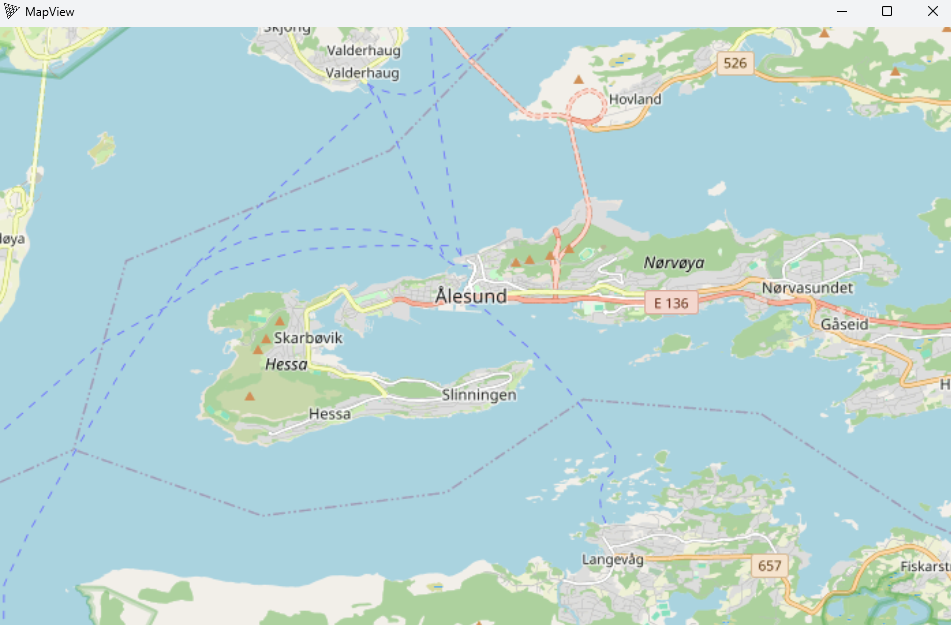

# threepp MapView demo

This is a C++ port of [geo-three](https://github.com/tentone/geo-three) for three.js using threepp.

### Dependency resolution using vcpkg
Call CMake with `-DCMAKE_TOOLCHAIN_FILE=[path to vcpkg]/scripts/buildsystems/vcpkg.cmake`
